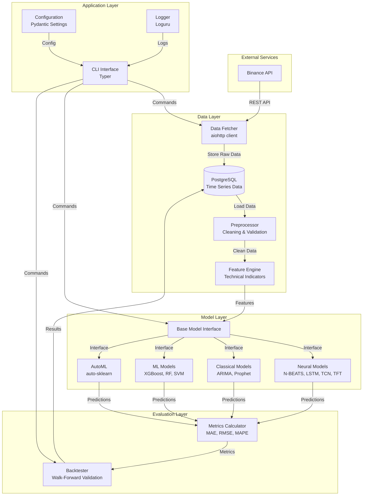

# Price Stradamus - System Architecture

## Overview

Price Stradamus follows a layered architecture with clear separation of concerns, enabling scalability, maintainability, and testability.

## System Architecture Diagram



## Component Responsibilities

### 1. Data Layer

#### Data Fetcher (`data/fetcher.py`)
**Responsibility**: Retrieve market data from Binance API

**Key Features**:
- Async HTTP client using aiohttp
- Rate limiting (1200 requests/minute)
- Exponential backoff retry logic
- Chunk-based historical data fetching (1000 candles per request)
- Support for multiple symbols and timeframes

**Interface**:
```python
class BinanceDataFetcher:
    async def fetch_ohlcv(
        symbol: str,
        timeframe: str,
        start_time: datetime | None = None,
        end_time: datetime | None = None,
    ) -> pd.DataFrame
```

**Error Handling**:
- Network errors → Retry with backoff
- Rate limit errors → Wait and retry
- Invalid symbol → Raise `DataFetchError`

#### Database (`data/database.py`)
**Responsibility**: Persist and retrieve time series data

**Schema Design**:

**Table: `market_data.ohlcv_raw`**
```sql
CREATE TABLE market_data.ohlcv_raw (
    id BIGSERIAL PRIMARY KEY,
    timestamp TIMESTAMPTZ NOT NULL,
    symbol VARCHAR(20) NOT NULL,
    timeframe VARCHAR(10) NOT NULL,
    open DECIMAL(20, 8) NOT NULL,
    high DECIMAL(20, 8) NOT NULL,
    low DECIMAL(20, 8) NOT NULL,
    close DECIMAL(20, 8) NOT NULL,
    volume DECIMAL(20, 8) NOT NULL,
    created_at TIMESTAMPTZ DEFAULT NOW(),
    UNIQUE(timestamp, symbol, timeframe)
);
CREATE INDEX idx_ohlcv_symbol_time ON market_data.ohlcv_raw(symbol, timeframe, timestamp DESC);
```

**Table: `market_data.features`**
```sql
CREATE TABLE market_data.features (
    id BIGSERIAL PRIMARY KEY,
    timestamp TIMESTAMPTZ NOT NULL,
    symbol VARCHAR(20) NOT NULL,
    timeframe VARCHAR(10) NOT NULL,
    features JSONB NOT NULL,  -- Flexible feature storage
    created_at TIMESTAMPTZ DEFAULT NOW(),
    UNIQUE(timestamp, symbol, timeframe)
);
CREATE INDEX idx_features_symbol_time ON market_data.features(symbol, timeframe, timestamp DESC);
CREATE INDEX idx_features_gin ON market_data.features USING GIN(features);
```

**Table: `ml_data.predictions`**
```sql
CREATE TABLE ml_data.predictions (
    id BIGSERIAL PRIMARY KEY,
    prediction_time TIMESTAMPTZ NOT NULL,
    target_time TIMESTAMPTZ NOT NULL,
    model_name VARCHAR(50) NOT NULL,
    symbol VARCHAR(20) NOT NULL,
    timeframe VARCHAR(10) NOT NULL,
    predicted_value DECIMAL(20, 8) NOT NULL,
    actual_value DECIMAL(20, 8),
    features_used JSONB,
    created_at TIMESTAMPTZ DEFAULT NOW()
);
CREATE INDEX idx_pred_model_time ON ml_data.predictions(model_name, target_time DESC);
```

**Table: `ml_data.model_metadata`**
```sql
CREATE TABLE ml_data.model_metadata (
    id BIGSERIAL PRIMARY KEY,
    model_name VARCHAR(50) NOT NULL,
    model_type VARCHAR(50) NOT NULL,
    hyperparameters JSONB NOT NULL,
    training_metrics JSONB NOT NULL,
    trained_at TIMESTAMPTZ NOT NULL,
    model_path VARCHAR(255),
    is_active BOOLEAN DEFAULT FALSE,
    created_at TIMESTAMPTZ DEFAULT NOW()
);
CREATE INDEX idx_model_name ON ml_data.model_metadata(model_name);
```

**Connection Management**:
- Use `asyncpg` for async PostgreSQL
- Connection pooling (min: 10, max: 20 connections)
- Automatic reconnection on failure
- Transaction support for batch operations

#### Preprocessor (`data/preprocessor.py`)
**Responsibility**: Clean and validate raw data

**Operations**:
1. **Missing Value Handling**
   - Forward fill for OHLCV (last known value)
   - Interpolation for gaps < 5 candles
   - Drop gaps > 5 candles (data quality issue)

2. **Outlier Detection**
   - Z-score method (threshold: 5σ)
   - Price jump detection (> 10% in 1 minute)
   - Log suspicious data for review

3. **Data Validation**
   - Ensure high ≥ open, close, low
   - Ensure low ≤ open, close, high
   - Volume must be non-negative
   - Timestamps must be sequential

4. **Normalization**
   - MinMaxScaler (default): Scale to [0, 1]
   - StandardScaler: Zero mean, unit variance
   - RobustScaler: Median and IQR (robust to outliers)

#### Feature Engine (`data/features.py`)
**Responsibility**: Generate technical indicators

**Feature Categories**:

1. **Price-Based**
   - Returns: `(close - close_lag1) / close_lag1`
   - Log returns: `log(close / close_lag1)`
   - Price changes: `close - open`

2. **Moving Averages**
   - SMA: 7, 14, 30, 50, 200 periods
   - EMA: 7, 14, 30, 50, 200 periods
   - WMA: Weighted moving average

3. **Volatility**
   - ATR (Average True Range): 14 periods
   - Bollinger Bands: 20 periods, 2 std dev
   - Standard deviation: 14, 30 periods

4. **Momentum**
   - RSI (Relative Strength Index): 14 periods
   - MACD: 12, 26, 9 periods
   - Stochastic: 14, 3, 3 periods
   - ROC (Rate of Change): 12 periods
   - MOM (Momentum): 10 periods

5. **Volume**
   - OBV (On-Balance Volume)
   - VWAP (Volume-Weighted Average Price)
   - Volume SMA: 20 periods

6. **Trend**
   - ADX (Average Directional Index): 14 periods
   - Aroon: 25 periods
   - CCI (Commodity Channel Index): 20 periods

**Lag Features**:
- Create lags: 1, 2, 3, 5, 10, 15, 30 candles back
- Example: `close_lag1`, `rsi_lag5`, `volume_lag10`

**Output Format**:
- Darts `TimeSeries` object
- Multi-variate series with all features
- Properly indexed by timestamp

### 2. Model Layer

#### Base Model Interface (`models/base.py`)
**Responsibility**: Define common interface for all models

**Abstract Methods**:
```python
class BaseModel(ABC):
    @abstractmethod
    def fit(self, train_data: TimeSeries, val_data: TimeSeries | None = None) -> None:
        """Train the model."""

    @abstractmethod
    def predict(self, n: int) -> TimeSeries:
        """Predict n steps ahead."""

    @abstractmethod
    def save(self, path: Path) -> None:
        """Save model to disk."""

    @classmethod
    @abstractmethod
    def load(cls, path: Path) -> Self:
        """Load model from disk."""

    @abstractmethod
    def get_params(self) -> dict[str, Any]:
        """Get model hyperparameters."""

    @abstractmethod
    def set_params(self, **params: Any) -> None:
        """Set model hyperparameters."""

    @property
    @abstractmethod
    def name(self) -> str:
        """Model name."""

    @property
    @abstractmethod
    def is_fitted(self) -> bool:
        """Whether model is trained."""
```

**Benefits**:
- Consistent interface across all models
- Easy to add new models
- Simplified model comparison
- Plugin architecture

#### Model Registry
**Responsibility**: Central registry of available models

```python
MODEL_REGISTRY = {
    "nbeats": NBEATSModel,
    "lstm": LSTMModel,
    "tcn": TCNModel,
    "tft": TFTModel,
    "arima": ARIMAModel,
    "prophet": ProphetModel,
    "xgboost": XGBoostModel,
    "random_forest": RandomForestModel,
}

def get_model(name: str) -> type[BaseModel]:
    if name not in MODEL_REGISTRY:
        raise ValueError(f"Unknown model: {name}")
    return MODEL_REGISTRY[name]
```

### 3. Evaluation Layer

#### Metrics Calculator (`evaluation/metrics.py`)
**Responsibility**: Compute prediction quality metrics

**Metrics Implemented**:
- MAE (Mean Absolute Error)
- MSE (Mean Squared Error)
- RMSE (Root Mean Squared Error)
- MAPE (Mean Absolute Percentage Error)
- sMAPE (Symmetric MAPE)
- R² Score
- Max Error
- Directional Accuracy

**Statistical Tests**:
- Diebold-Mariano test (compare two models)
- Shapiro-Wilk test (residual normality)

#### Backtester (`evaluation/backtester.py`)
**Responsibility**: Evaluate models on historical data

**Walk-Forward Validation**:
```
Train Window | Test | Train Window    | Test |
-------------|------|-----------------|------|
1000 candles | 100  | 1100 candles    | 100  |
             ▲                        ▲
           Predict                 Predict
```

**Validation Methods**:
1. **Expanding Window**: Training set grows over time
2. **Sliding Window**: Fixed-size training set moves forward

**Process**:
1. Split data into folds
2. For each fold:
   - Train model on training window
   - Predict on test window
   - Calculate metrics
   - Store predictions
3. Aggregate metrics across folds
4. Generate performance report

### 4. Application Layer

#### CLI Interface (`cli/commands.py`)
**Responsibility**: User-facing command-line interface

**Commands**:
- `fetch`: Download data from Binance
- `train`: Train a specific model
- `predict`: Make predictions
- `evaluate`: Run backtesting
- `compare`: Compare multiple models
- `automl`: Run automated model selection

**Implementation**: Typer framework with Rich for formatting

#### Configuration (`config/settings.py`)
**Responsibility**: Centralized configuration management

**Features**:
- Pydantic Settings for validation
- Environment variable support
- Type-safe configuration
- Default values with overrides

#### Logger (`utils/logger.py`)
**Responsibility**: Structured logging

**Features**:
- Loguru for easy logging
- Separate log files by level
- JSON formatting for production
- Rotation and retention policies

## Interface Contracts

### Data Fetcher → Database
```python
# Fetcher returns DataFrame
df: pd.DataFrame = await fetcher.fetch_ohlcv(...)

# Database stores it
await db.store_ohlcv(df, symbol="BTCUSDT", timeframe="1m")
```

### Database → Feature Engine
```python
# Load raw data
df: pd.DataFrame = await db.load_ohlcv(symbol, timeframe, start, end)

# Generate features
features: TimeSeries = feature_engine.generate_features(df)
```

### Feature Engine → Models
```python
# Features are Darts TimeSeries
features: TimeSeries = ...

# Models accept TimeSeries
model.fit(train_data=features[:train_size])
predictions: TimeSeries = model.predict(n=5)
```

### Models → Evaluation
```python
# Predictions are TimeSeries
predictions: TimeSeries = model.predict(n=5)
actual: TimeSeries = test_data

# Calculate metrics
metrics: Metrics = calculate_metrics(actual, predictions)
```

## Scalability Considerations

### Data Storage
- **Partitioning**: Partition `ohlcv_raw` by month for faster queries
- **Indexing**: B-tree indexes on (symbol, timeframe, timestamp)
- **Archival**: Move old data to cold storage (S3) after 1 year

### Compute
- **GPU Acceleration**: Use CUDA for neural network training
- **Parallelization**: Train multiple models in parallel
- **Batch Processing**: Process multiple symbols concurrently

### API Rate Limits
- **Binance Limits**: 1200 requests/minute, 100,000/day
- **Strategy**: Use WebSocket for real-time data, REST for historical
- **Caching**: Cache historical data to reduce API calls

### Database Performance
- **Connection Pooling**: Reuse connections (10-20 pool size)
- **Batch Inserts**: Insert 1000 rows at a time
- **Read Replicas**: Use read replicas for queries (future)

## Security Considerations

### API Keys
- Store in environment variables (never in code)
- Use secrets management (AWS Secrets Manager, GCP Secret Manager)
- Rotate keys regularly

### Database
- Use strong passwords (20+ characters)
- Enable SSL/TLS for connections
- Principle of least privilege (separate read/write users)

### Docker
- Run containers as non-root user
- Use minimal base images (alpine)
- Scan images for vulnerabilities

## Monitoring & Observability

### Logging
- **Levels**: DEBUG (development), INFO (production)
- **Structured**: JSON format for log aggregation
- **Rotation**: Daily rotation, keep 30 days

### Metrics
- Model training time
- Prediction latency
- API response time
- Database query time
- Error rates

### Alerting
- Failed model training
- Database connection errors
- API rate limit exceeded
- Disk space low

## Deployment Architecture (Future)

```
┌──────────────────────────────────────────┐
│           Google Cloud Platform           │
│                                          │
│  ┌────────────┐    ┌─────────────┐     │
│  │  Cloud Run │───▶│ Cloud SQL   │     │
│  │  (API)     │    │ (PostgreSQL)│     │
│  └────────────┘    └─────────────┘     │
│        │                                 │
│        ▼                                 │
│  ┌────────────┐    ┌─────────────┐     │
│  │  Cloud     │    │ Cloud       │     │
│  │  Storage   │    │ Scheduler   │     │
│  │  (Models)  │    │ (Training)  │     │
│  └────────────┘    └─────────────┘     │
│                                          │
│  ┌─────────────────────────────────┐   │
│  │  Vertex AI (Model Training)     │   │
│  └─────────────────────────────────┘   │
└──────────────────────────────────────────┘
```

---

## C4 Model Diagrams

The C4 model provides a hierarchical approach to software architecture documentation: Context, Containers, Components, and Code.

### Level 1: System Context

Shows the system's place in its environment.

```
┌─────────────────────────────────────────────────────────────┐
│                      System Context                          │
│                                                              │
│  ┌──────────────┐                    ┌──────────────┐      │
│  │   Trader     │                    │   Analyst    │      │
│  │   (User)     │                    │   (User)     │      │
│  └──────┬───────┘                    └──────┬───────┘      │
│         │                                    │              │
│         │  CLI/API Requests                  │              │
│         │                                    │              │
│         ▼                                    ▼              │
│  ┌─────────────────────────────────────────────────────┐   │
│  │                                                      │   │
│  │              Price Stradamus System                  │   │
│  │                                                      │   │
│  │  Bitcoin price prediction using ML models           │   │
│  │  Provides forecasts, backtesting, and evaluation    │   │
│  │                                                      │   │
│  └──────────────────────────────────────────────────────┘   │
│                          │                                   │
│         ┌───────────────┼───────────────┐                  │
│         │               │               │                  │
│         ▼               ▼               ▼                  │
│  ┌────────────┐  ┌────────────┐  ┌────────────┐          │
│  │ Binance    │  │ PostgreSQL │  │ Monitoring │          │
│  │ Exchange   │  │ Database   │  │ (Grafana)  │          │
│  │ API        │  │            │  │            │          │
│  └────────────┘  └────────────┘  └────────────┘          │
│                                                              │
└─────────────────────────────────────────────────────────────┘
```

### Level 2: Container Diagram

Shows the high-level technical components.

```
┌─────────────────────────────────────────────────────────────────────┐
│                       Container Diagram                              │
│                                                                      │
│  ┌─────────────────────────────────────────────────────────────┐   │
│  │                  Price Stradamus System                      │   │
│  │                                                              │   │
│  │  ┌──────────────┐    ┌──────────────┐    ┌──────────────┐  │   │
│  │  │   CLI App    │    │  Prediction  │    │   Training   │  │   │
│  │  │  (Python)    │───▶│   Service    │───▶│   Service    │  │   │
│  │  │              │    │  (Python)    │    │  (Python)    │  │   │
│  │  └──────────────┘    └──────────────┘    └──────────────┘  │   │
│  │         │                   │                   │           │   │
│  │         │                   │                   │           │   │
│  │         ▼                   ▼                   ▼           │   │
│  │  ┌─────────────────────────────────────────────────────┐   │   │
│  │  │              Shared Data Layer                      │   │   │
│  │  │  (Database, Feature Store, Model Registry)          │   │   │
│  │  └─────────────────────────────────────────────────────┘   │   │
│  │                                                              │   │
│  └─────────────────────────────────────────────────────────────┘   │
│                                                                      │
│  External:                                                           │
│  ┌──────────────┐    ┌──────────────┐    ┌──────────────┐          │
│  │  Binance     │    │  PostgreSQL  │    │  Redis       │          │
│  │  REST/WS     │    │  TimescaleDB │    │  (Cache)     │          │
│  └──────────────┘    └──────────────┘    └──────────────┘          │
│                                                                      │
└─────────────────────────────────────────────────────────────────────┘
```

### Level 3: Component Diagram (Data Layer)

```
┌─────────────────────────────────────────────────────────────────────┐
│                    Data Layer Components                             │
│                                                                      │
│  ┌──────────────────┐                                               │
│  │  Data Fetcher    │ Binance API                                   │
│  │  ┌────────────┐  │───────────────┐                               │
│  │  │ REST Client│  │               ▼                               │
│  │  │ WS Client  │  │      ┌──────────────────┐                    │
│  │  │ Rate Limit │  │      │  Data Validator  │                    │
│  │  └────────────┘  │      │  ┌────────────┐  │                    │
│  └──────────────────┘      │  │ OHLCV Check│  │                    │
│                             │  │ Anomaly Det│  │                    │
│                             │  │ Gap Handler│  │                    │
│                             │  └────────────┘  │                    │
│                             └────────┬─────────┘                    │
│                                      │                               │
│                                      ▼                               │
│  ┌──────────────────────────────────────────────────────────────┐  │
│  │                    Database Manager                           │  │
│  │  ┌──────────────┐  ┌──────────────┐  ┌──────────────┐       │  │
│  │  │ OHLCV Store  │  │ Feature Store│  │Prediction Str│       │  │
│  │  └──────────────┘  └──────────────┘  └──────────────┘       │  │
│  └──────────────────────────────────────────────────────────────┘  │
│                                      │                               │
│                                      ▼                               │
│  ┌──────────────────────────────────────────────────────────────┐  │
│  │                    Feature Engine                             │  │
│  │  ┌────────────┐  ┌────────────┐  ┌────────────┐             │  │
│  │  │ Technical  │  │ Statistical│  │ Custom     │             │  │
│  │  │ Indicators │  │ Features   │  │ Features   │             │  │
│  │  │ (pandas-ta)│  │ (numpy)    │  │            │             │  │
│  │  └────────────┘  └────────────┘  └────────────┘             │  │
│  └──────────────────────────────────────────────────────────────┘  │
│                                                                      │
└─────────────────────────────────────────────────────────────────────┘
```

### Level 4: Code Diagram (Model Layer)

```python
# Code-level architecture for Model Layer

from __future__ import annotations

from abc import ABC, abstractmethod
from dataclasses import dataclass
from pathlib import Path
from typing import Any, Protocol


# Protocol definitions for dependency injection
class DataLoader(Protocol):
    """Protocol for data loading."""

    async def load(
        self,
        symbol: str,
        start: datetime,
        end: datetime,
    ) -> TimeSeries: ...


class ModelPersistence(Protocol):
    """Protocol for model save/load."""

    def save(self, model: Any, path: Path) -> None: ...
    def load(self, path: Path) -> Any: ...


# Base model with clear interfaces
class BaseModel(ABC):
    """Abstract base for all forecasting models."""

    def __init__(
        self,
        data_loader: DataLoader,
        persistence: ModelPersistence,
    ) -> None:
        self._data_loader = data_loader
        self._persistence = persistence
        self._is_fitted = False

    @abstractmethod
    def fit(
        self,
        train_data: TimeSeries,
        val_data: TimeSeries | None = None,
    ) -> TrainingResult: ...

    @abstractmethod
    def predict(self, n: int) -> PredictionResult: ...


@dataclass
class TrainingResult:
    """Result of model training."""

    model_name: str
    training_time: float
    epochs_completed: int
    final_loss: float
    validation_metrics: dict[str, float]


@dataclass
class PredictionResult:
    """Result of model prediction."""

    predictions: TimeSeries
    confidence_intervals: dict[float, TimeSeries] | None
    inference_time: float
```

---

## Architecture Decision Records (ADRs)

### ADR-001: Use Darts Library for Time Series Models

**Status**: Accepted

**Context**:
We need a library for time series forecasting that supports multiple model architectures and provides a consistent API.

**Decision**:
Use the Darts library by Unit8 as the primary forecasting framework.

**Consequences**:
- **Positive**: Unified API for neural and classical models, built on PyTorch, active development
- **Negative**: Additional dependency, may limit customization of model internals
- **Risks**: Library abandonment (mitigated by MIT license allowing forking)

**Alternatives Considered**:
1. Raw PyTorch - More flexibility but more boilerplate
2. GluonTS - Good but primarily MXNet-based
3. Statsmodels - Classical only, no deep learning

---

### ADR-002: PostgreSQL with TimescaleDB Extension

**Status**: Accepted

**Context**:
We need efficient storage for time series data with good query performance and support for JSONB (for flexible feature storage).

**Decision**:
Use PostgreSQL with TimescaleDB extension for time series optimization.

**Consequences**:
- **Positive**: Mature database, excellent query performance, JSONB support, TimescaleDB hypertables
- **Negative**: More complex setup than simple file storage
- **Risks**: Lock-in to PostgreSQL (mitigated by SQL standard compliance)

**Alternatives Considered**:
1. InfluxDB - Good for time series but weaker for relational queries
2. Parquet files - Simple but lacks query optimization
3. MongoDB - Flexible but weaker consistency guarantees

---

### ADR-003: Async-First Architecture

**Status**: Accepted

**Context**:
The system involves multiple I/O operations (API calls, database queries) that would benefit from concurrent execution.

**Decision**:
Use async/await throughout the codebase with asyncio and asyncpg.

**Consequences**:
- **Positive**: Better resource utilization, improved latency for I/O-bound operations
- **Negative**: More complex testing, need for async-aware libraries
- **Risks**: Complexity in debugging async code

**Alternatives Considered**:
1. Threading - More complex state management
2. Multiprocessing - Overhead for small tasks
3. Synchronous - Simpler but slower

---

### ADR-004: Walk-Forward Validation as Default

**Status**: Accepted

**Context**:
Financial time series has temporal dependencies that make random train/test splits invalid.

**Decision**:
Use walk-forward validation as the default evaluation methodology.

**Consequences**:
- **Positive**: Prevents lookahead bias, realistic performance estimates
- **Negative**: Slower evaluation (multiple training runs), requires more data
- **Risks**: Higher computational cost

**Alternatives Considered**:
1. Simple train/test split - Prone to lookahead bias
2. K-fold cross-validation - Invalid for time series
3. Time-based split only - Single estimate, high variance

---

### ADR-005: Feature Engineering with pandas-ta

**Status**: Accepted

**Context**:
Need a comprehensive library for technical indicators that integrates with pandas.

**Decision**:
Use pandas-ta for technical indicator calculation.

**Consequences**:
- **Positive**: 130+ indicators, pandas integration, active development
- **Negative**: Some indicators have different implementations than traditional
- **Risks**: Library changes affecting reproducibility (pin version)

---

### ADR Template

```markdown
# ADR-XXX: [Title]

**Status**: [Proposed | Accepted | Deprecated | Superseded by ADR-YYY]

**Context**:
What is the issue that we're seeing that is motivating this decision or change?

**Decision**:
What is the change that we're proposing and/or doing?

**Consequences**:
- **Positive**: What becomes easier?
- **Negative**: What becomes more difficult?
- **Risks**: What could go wrong?

**Alternatives Considered**:
What other options did we consider and why were they rejected?
```

---

## Event-Driven Architecture (Phase 5+)

For real-time streaming predictions, the system will adopt event-driven patterns.

### Event Flow

```
┌─────────────────────────────────────────────────────────────────────┐
│                    Event-Driven Architecture                         │
│                                                                      │
│  ┌──────────────┐                                                   │
│  │   Binance    │                                                   │
│  │   WebSocket  │                                                   │
│  └──────┬───────┘                                                   │
│         │ Kline Events                                              │
│         ▼                                                            │
│  ┌──────────────────────────────────────────────────────────────┐  │
│  │                    Event Router (Redis Streams)              │  │
│  └──────────────────────────────────────────────────────────────┘  │
│         │              │              │              │              │
│         ▼              ▼              ▼              ▼              │
│  ┌───────────┐  ┌───────────┐  ┌───────────┐  ┌───────────┐      │
│  │  Data     │  │  Feature  │  │ Prediction │  │ Alert     │      │
│  │  Store    │  │  Compute  │  │ Generator  │  │ Service   │      │
│  └───────────┘  └───────────┘  └───────────┘  └───────────┘      │
│         │              │              │              │              │
│         └──────────────┴──────┬───────┴──────────────┘              │
│                               ▼                                      │
│                    ┌──────────────────┐                             │
│                    │  Event Store     │                             │
│                    │  (PostgreSQL)    │                             │
│                    └──────────────────┘                             │
│                                                                      │
└─────────────────────────────────────────────────────────────────────┘
```

### Event Definitions

```python
from __future__ import annotations

from dataclasses import dataclass, field
from datetime import datetime
from enum import Enum
from typing import Any
import uuid


class EventType(str, Enum):
    """Event types in the system."""

    # Market data events
    CANDLE_CLOSED = "candle_closed"
    CANDLE_UPDATE = "candle_update"
    TRADE_EXECUTED = "trade_executed"

    # Processing events
    FEATURES_COMPUTED = "features_computed"
    PREDICTION_GENERATED = "prediction_generated"
    PREDICTION_EVALUATED = "prediction_evaluated"

    # System events
    MODEL_TRAINED = "model_trained"
    MODEL_DEPLOYED = "model_deployed"
    DRIFT_DETECTED = "drift_detected"

    # Alert events
    PRICE_ALERT = "price_alert"
    ACCURACY_ALERT = "accuracy_alert"


@dataclass
class Event:
    """Base event class."""

    event_id: str = field(default_factory=lambda: str(uuid.uuid4()))
    event_type: EventType = EventType.CANDLE_CLOSED
    timestamp: datetime = field(default_factory=datetime.now)
    source: str = "unknown"
    correlation_id: str | None = None
    payload: dict[str, Any] = field(default_factory=dict)

    def to_dict(self) -> dict[str, Any]:
        """Serialize event to dictionary."""
        return {
            "event_id": self.event_id,
            "event_type": self.event_type.value,
            "timestamp": self.timestamp.isoformat(),
            "source": self.source,
            "correlation_id": self.correlation_id,
            "payload": self.payload,
        }

    @classmethod
    def from_dict(cls, data: dict[str, Any]) -> Event:
        """Deserialize event from dictionary."""
        return cls(
            event_id=data["event_id"],
            event_type=EventType(data["event_type"]),
            timestamp=datetime.fromisoformat(data["timestamp"]),
            source=data["source"],
            correlation_id=data.get("correlation_id"),
            payload=data.get("payload", {}),
        )


@dataclass
class CandleClosedEvent(Event):
    """Event when a candle closes."""

    event_type: EventType = EventType.CANDLE_CLOSED

    @property
    def symbol(self) -> str:
        return self.payload.get("symbol", "")

    @property
    def timeframe(self) -> str:
        return self.payload.get("timeframe", "")

    @property
    def ohlcv(self) -> dict[str, float]:
        return {
            "open": self.payload.get("open", 0),
            "high": self.payload.get("high", 0),
            "low": self.payload.get("low", 0),
            "close": self.payload.get("close", 0),
            "volume": self.payload.get("volume", 0),
        }


@dataclass
class PredictionGeneratedEvent(Event):
    """Event when a prediction is generated."""

    event_type: EventType = EventType.PREDICTION_GENERATED

    @property
    def model_name(self) -> str:
        return self.payload.get("model_name", "")

    @property
    def predictions(self) -> list[float]:
        return self.payload.get("predictions", [])

    @property
    def confidence_intervals(self) -> dict[str, list[float]]:
        return self.payload.get("confidence_intervals", {})
```

### Event Handlers

```python
from __future__ import annotations

from abc import ABC, abstractmethod
from typing import Callable, TypeVar

import asyncio


E = TypeVar("E", bound=Event)


class EventHandler(ABC):
    """Abstract event handler."""

    @abstractmethod
    async def handle(self, event: Event) -> None:
        """Handle an event."""
        ...

    @property
    @abstractmethod
    def handles(self) -> list[EventType]:
        """Event types this handler processes."""
        ...


class EventBus:
    """Simple event bus for event routing."""

    def __init__(self) -> None:
        self._handlers: dict[EventType, list[EventHandler]] = {}
        self._middlewares: list[Callable] = []

    def register(self, handler: EventHandler) -> None:
        """Register an event handler."""
        for event_type in handler.handles:
            if event_type not in self._handlers:
                self._handlers[event_type] = []
            self._handlers[event_type].append(handler)

    def add_middleware(self, middleware: Callable) -> None:
        """Add middleware for event processing."""
        self._middlewares.append(middleware)

    async def publish(self, event: Event) -> None:
        """Publish event to all registered handlers."""
        # Apply middleware
        for middleware in self._middlewares:
            event = await middleware(event)
            if event is None:
                return  # Middleware filtered event

        # Dispatch to handlers
        handlers = self._handlers.get(event.event_type, [])
        await asyncio.gather(
            *[handler.handle(event) for handler in handlers],
            return_exceptions=True,
        )


# Example handlers
class FeatureComputeHandler(EventHandler):
    """Compute features when new candle arrives."""

    @property
    def handles(self) -> list[EventType]:
        return [EventType.CANDLE_CLOSED]

    async def handle(self, event: Event) -> None:
        if not isinstance(event, CandleClosedEvent):
            return

        # Compute features
        features = await self._compute_features(event.symbol, event.ohlcv)

        # Publish feature event
        feature_event = Event(
            event_type=EventType.FEATURES_COMPUTED,
            source="feature_compute_handler",
            correlation_id=event.event_id,
            payload={"features": features, "symbol": event.symbol},
        )
        # Would publish to event bus

    async def _compute_features(
        self,
        symbol: str,
        ohlcv: dict[str, float],
    ) -> dict[str, float]:
        """Compute features from OHLCV."""
        # Implementation
        return {}


class PredictionHandler(EventHandler):
    """Generate predictions when features are ready."""

    @property
    def handles(self) -> list[EventType]:
        return [EventType.FEATURES_COMPUTED]

    async def handle(self, event: Event) -> None:
        # Generate prediction using model
        pass
```

---

## CQRS Pattern (Future Consideration)

Command Query Responsibility Segregation separates read and write models for better scalability.

### CQRS Structure

```
┌─────────────────────────────────────────────────────────────────────┐
│                         CQRS Architecture                            │
│                                                                      │
│  Commands (Write)                    Queries (Read)                 │
│  ┌──────────────────┐               ┌──────────────────┐           │
│  │  Store Candle    │               │  Get Predictions │           │
│  │  Train Model     │               │  Get Metrics     │           │
│  │  Save Prediction │               │  Get History     │           │
│  └────────┬─────────┘               └────────┬─────────┘           │
│           │                                   │                     │
│           ▼                                   ▼                     │
│  ┌──────────────────┐               ┌──────────────────┐           │
│  │  Command Handler │               │  Query Handler   │           │
│  └────────┬─────────┘               └────────┬─────────┘           │
│           │                                   │                     │
│           ▼                                   ▼                     │
│  ┌──────────────────┐               ┌──────────────────┐           │
│  │   Write Model    │  ──Events──▶  │   Read Model     │           │
│  │   (PostgreSQL)   │               │   (Materialized  │           │
│  │                  │               │    Views/Redis)  │           │
│  └──────────────────┘               └──────────────────┘           │
│                                                                      │
└─────────────────────────────────────────────────────────────────────┘
```

### CQRS Implementation Sketch

```python
from __future__ import annotations

from abc import ABC, abstractmethod
from dataclasses import dataclass
from typing import Any, Generic, TypeVar


# Command types
T = TypeVar("T")


@dataclass
class Command(ABC):
    """Base command class."""

    pass


@dataclass
class StoreCandle(Command):
    """Command to store a candle."""

    symbol: str
    timeframe: str
    timestamp: datetime
    ohlcv: dict[str, float]


@dataclass
class TrainModel(Command):
    """Command to train a model."""

    model_name: str
    symbol: str
    start_date: datetime
    end_date: datetime
    hyperparameters: dict[str, Any]


class CommandHandler(ABC, Generic[T]):
    """Abstract command handler."""

    @abstractmethod
    async def handle(self, command: T) -> Any:
        """Handle a command."""
        ...


# Query types
@dataclass
class Query(ABC):
    """Base query class."""

    pass


@dataclass
class GetPredictions(Query):
    """Query for predictions."""

    symbol: str
    model_name: str
    start_time: datetime
    end_time: datetime


@dataclass
class GetMetricsSummary(Query):
    """Query for metrics summary."""

    model_name: str
    lookback_days: int = 30


class QueryHandler(ABC, Generic[T]):
    """Abstract query handler."""

    @abstractmethod
    async def handle(self, query: T) -> Any:
        """Handle a query."""
        ...


# Mediator pattern for dispatch
class Mediator:
    """Mediator for command/query dispatch."""

    def __init__(self) -> None:
        self._command_handlers: dict[type, CommandHandler] = {}
        self._query_handlers: dict[type, QueryHandler] = {}

    def register_command_handler(
        self,
        command_type: type[Command],
        handler: CommandHandler,
    ) -> None:
        self._command_handlers[command_type] = handler

    def register_query_handler(
        self,
        query_type: type[Query],
        handler: QueryHandler,
    ) -> None:
        self._query_handlers[query_type] = handler

    async def send(self, command: Command) -> Any:
        """Send a command."""
        handler = self._command_handlers.get(type(command))
        if handler is None:
            raise ValueError(f"No handler for {type(command)}")
        return await handler.handle(command)

    async def query(self, query: Query) -> Any:
        """Execute a query."""
        handler = self._query_handlers.get(type(query))
        if handler is None:
            raise ValueError(f"No handler for {type(query)}")
        return await handler.handle(query)
```

---

## Data Mesh Principles (Future Multi-Asset)

For scaling to multiple assets, adopt Data Mesh principles:

### Domain-Oriented Data Ownership

```
┌─────────────────────────────────────────────────────────────────────┐
│                      Data Mesh Architecture                          │
│                                                                      │
│  ┌──────────────────────────────────────────────────────────────┐  │
│  │                    Bitcoin Domain                             │  │
│  │  Owner: BTC Team                                             │  │
│  │  Products: btc_ohlcv, btc_features, btc_predictions          │  │
│  │  SLA: 99.9% availability, <100ms latency                     │  │
│  └──────────────────────────────────────────────────────────────┘  │
│                                                                      │
│  ┌──────────────────────────────────────────────────────────────┐  │
│  │                   Ethereum Domain                             │  │
│  │  Owner: ETH Team                                             │  │
│  │  Products: eth_ohlcv, eth_features, eth_predictions          │  │
│  │  SLA: 99.9% availability, <100ms latency                     │  │
│  └──────────────────────────────────────────────────────────────┘  │
│                                                                      │
│  ┌──────────────────────────────────────────────────────────────┐  │
│  │                 Cross-Asset Domain                            │  │
│  │  Owner: Correlation Team                                     │  │
│  │  Products: correlation_matrix, regime_state, portfolio_risk  │  │
│  │  Consumes: btc_*, eth_*, sol_*, ...                          │  │
│  └──────────────────────────────────────────────────────────────┘  │
│                                                                      │
└─────────────────────────────────────────────────────────────────────┘
```

### Data Product Specification

```python
from __future__ import annotations

from dataclasses import dataclass
from datetime import datetime


@dataclass
class DataProduct:
    """Specification for a data product in Data Mesh."""

    # Identification
    name: str
    domain: str
    owner: str
    version: str

    # Schema
    schema_definition: str  # JSON Schema or Avro
    sample_data_url: str

    # Discovery
    description: str
    tags: list[str]
    documentation_url: str

    # Quality
    sla_availability: float  # e.g., 99.9
    sla_latency_ms: int
    quality_metrics: dict[str, float]
    freshness_sla_minutes: int

    # Access
    access_pattern: str  # "batch", "streaming", "api"
    endpoint: str
    authentication_method: str

    # Lineage
    upstream_dependencies: list[str]
    downstream_consumers: list[str]

    # Governance
    classification: str  # "public", "internal", "confidential"
    retention_days: int
    gdpr_compliant: bool


# Example data product
btc_predictions_product = DataProduct(
    name="btc_predictions",
    domain="bitcoin",
    owner="bitcoin-team@company.com",
    version="1.0.0",
    schema_definition='{"type": "object", "properties": {...}}',
    sample_data_url="s3://data-products/btc_predictions/sample.json",
    description="5-minute Bitcoin price predictions from ensemble model",
    tags=["bitcoin", "predictions", "real-time"],
    documentation_url="https://docs.company.com/data/btc_predictions",
    sla_availability=99.9,
    sla_latency_ms=100,
    quality_metrics={"directional_accuracy": 0.54, "mape": 0.008},
    freshness_sla_minutes=1,
    access_pattern="streaming",
    endpoint="kafka://predictions-cluster/btc-predictions",
    authentication_method="oauth2",
    upstream_dependencies=["btc_ohlcv", "btc_features"],
    downstream_consumers=["trading-bot", "dashboard", "alerts"],
    classification="internal",
    retention_days=90,
    gdpr_compliant=True,
)
```

---

## Failure Mode Analysis

### Single Points of Failure (SPOFs)

| Component | SPOF Risk | Mitigation |
|-----------|-----------|------------|
| PostgreSQL | High | Read replicas, automated failover |
| Binance API | High | Multi-exchange support, cached data fallback |
| Model Serving | Medium | Multiple replicas, circuit breaker |
| Feature Engine | Medium | Pre-computed features, graceful degradation |
| Redis Cache | Low | In-memory fallback, async writes |

### Failure Scenarios and Recovery

```python
from __future__ import annotations

from dataclasses import dataclass
from enum import Enum
from datetime import datetime, timedelta


class FailureType(str, Enum):
    """Types of system failures."""

    DATABASE_UNAVAILABLE = "database_unavailable"
    API_RATE_LIMITED = "api_rate_limited"
    MODEL_LOAD_FAILED = "model_load_failed"
    FEATURE_COMPUTATION_FAILED = "feature_computation_failed"
    PREDICTION_TIMEOUT = "prediction_timeout"


@dataclass
class FailureScenario:
    """Documented failure scenario with recovery."""

    failure_type: FailureType
    description: str
    detection_method: str
    recovery_procedure: list[str]
    expected_recovery_time: timedelta
    impact: str
    prevention: str


FAILURE_SCENARIOS = [
    FailureScenario(
        failure_type=FailureType.DATABASE_UNAVAILABLE,
        description="PostgreSQL database is unreachable",
        detection_method="Health check fails, connection timeout",
        recovery_procedure=[
            "1. Check database container status",
            "2. Verify network connectivity",
            "3. Check disk space",
            "4. Restart database if needed",
            "5. Failover to replica if primary is down",
        ],
        expected_recovery_time=timedelta(minutes=5),
        impact="No new data storage, predictions use cached features",
        prevention="Monitor disk space, set up automated failover",
    ),
    FailureScenario(
        failure_type=FailureType.API_RATE_LIMITED,
        description="Binance API returns 429 Too Many Requests",
        detection_method="HTTP 429 response, rate limit header exceeded",
        recovery_procedure=[
            "1. Exponential backoff (wait 60s, 120s, 240s)",
            "2. Switch to WebSocket for real-time data",
            "3. Use cached historical data",
            "4. Alert if rate limit persists > 10 minutes",
        ],
        expected_recovery_time=timedelta(minutes=10),
        impact="Delayed data updates, predictions based on stale data",
        prevention="Implement proper rate limiting, use WebSocket",
    ),
    FailureScenario(
        failure_type=FailureType.MODEL_LOAD_FAILED,
        description="Model file corrupted or incompatible version",
        detection_method="Exception during model.load(), checksum mismatch",
        recovery_procedure=[
            "1. Log error with full stack trace",
            "2. Attempt to load previous model version",
            "3. If no fallback, use simple baseline model",
            "4. Alert ML team for investigation",
            "5. Retrain model if needed",
        ],
        expected_recovery_time=timedelta(hours=1),
        impact="Degraded predictions until model is fixed",
        prevention="Version models, keep N previous versions, automated testing",
    ),
]


class FailureRecovery:
    """Handle system failures gracefully."""

    def __init__(self) -> None:
        self.failure_count: dict[FailureType, int] = {}
        self.last_failure: dict[FailureType, datetime] = {}

    def record_failure(self, failure_type: FailureType) -> None:
        """Record a failure occurrence."""
        self.failure_count[failure_type] = (
            self.failure_count.get(failure_type, 0) + 1
        )
        self.last_failure[failure_type] = datetime.now()

    def should_circuit_break(
        self,
        failure_type: FailureType,
        threshold: int = 5,
        window: timedelta = timedelta(minutes=5),
    ) -> bool:
        """Check if circuit breaker should trip."""
        count = self.failure_count.get(failure_type, 0)
        last = self.last_failure.get(failure_type)

        if last is None:
            return False

        # Reset count if outside window
        if datetime.now() - last > window:
            self.failure_count[failure_type] = 0
            return False

        return count >= threshold
```

---

## Performance Budgets

### Latency SLOs by Component

| Component | P50 Target | P95 Target | P99 Target |
|-----------|------------|------------|------------|
| Data Fetch (1 candle) | 50ms | 100ms | 200ms |
| Feature Computation | 20ms | 50ms | 100ms |
| Model Inference (N-BEATS) | 5ms | 15ms | 30ms |
| Database Read | 5ms | 20ms | 50ms |
| Database Write | 10ms | 30ms | 100ms |
| API Response (prediction) | 100ms | 300ms | 500ms |
| End-to-End (new candle → prediction) | 200ms | 500ms | 1000ms |

### Performance Monitoring

```python
from __future__ import annotations

import time
from contextlib import contextmanager
from dataclasses import dataclass, field
from typing import Generator
import statistics


@dataclass
class LatencyTracker:
    """Track latency metrics for a component."""

    component: str
    measurements: list[float] = field(default_factory=list)
    max_measurements: int = 10000

    def record(self, latency_ms: float) -> None:
        """Record a latency measurement."""
        self.measurements.append(latency_ms)
        if len(self.measurements) > self.max_measurements:
            self.measurements = self.measurements[-self.max_measurements:]

    @contextmanager
    def measure(self) -> Generator[None, None, None]:
        """Context manager to measure operation latency."""
        start = time.perf_counter()
        try:
            yield
        finally:
            latency_ms = (time.perf_counter() - start) * 1000
            self.record(latency_ms)

    @property
    def p50(self) -> float:
        if not self.measurements:
            return 0.0
        return statistics.median(self.measurements)

    @property
    def p95(self) -> float:
        if not self.measurements:
            return 0.0
        return statistics.quantiles(self.measurements, n=20)[18]

    @property
    def p99(self) -> float:
        if not self.measurements:
            return 0.0
        return statistics.quantiles(self.measurements, n=100)[98]

    def check_budget(
        self,
        p50_target: float,
        p95_target: float,
        p99_target: float,
    ) -> dict[str, bool]:
        """Check if latency is within budget."""
        return {
            "p50_ok": self.p50 <= p50_target,
            "p95_ok": self.p95 <= p95_target,
            "p99_ok": self.p99 <= p99_target,
            "p50_actual": self.p50,
            "p95_actual": self.p95,
            "p99_actual": self.p99,
        }


class PerformanceMonitor:
    """Monitor performance across all components."""

    def __init__(self) -> None:
        self.trackers: dict[str, LatencyTracker] = {}

    def get_tracker(self, component: str) -> LatencyTracker:
        """Get or create tracker for component."""
        if component not in self.trackers:
            self.trackers[component] = LatencyTracker(component=component)
        return self.trackers[component]

    def generate_report(self) -> dict:
        """Generate performance report."""
        budgets = {
            "data_fetch": (50, 100, 200),
            "feature_compute": (20, 50, 100),
            "model_inference": (5, 15, 30),
            "database_read": (5, 20, 50),
            "database_write": (10, 30, 100),
        }

        report = {}
        for component, tracker in self.trackers.items():
            budget = budgets.get(component, (100, 300, 500))
            report[component] = tracker.check_budget(*budget)

        return report


# Usage
monitor = PerformanceMonitor()

async def fetch_candle(symbol: str) -> dict:
    tracker = monitor.get_tracker("data_fetch")
    with tracker.measure():
        # Actual fetch logic
        pass
    return {}
```

---

*Last Updated: 2025-12-03*
